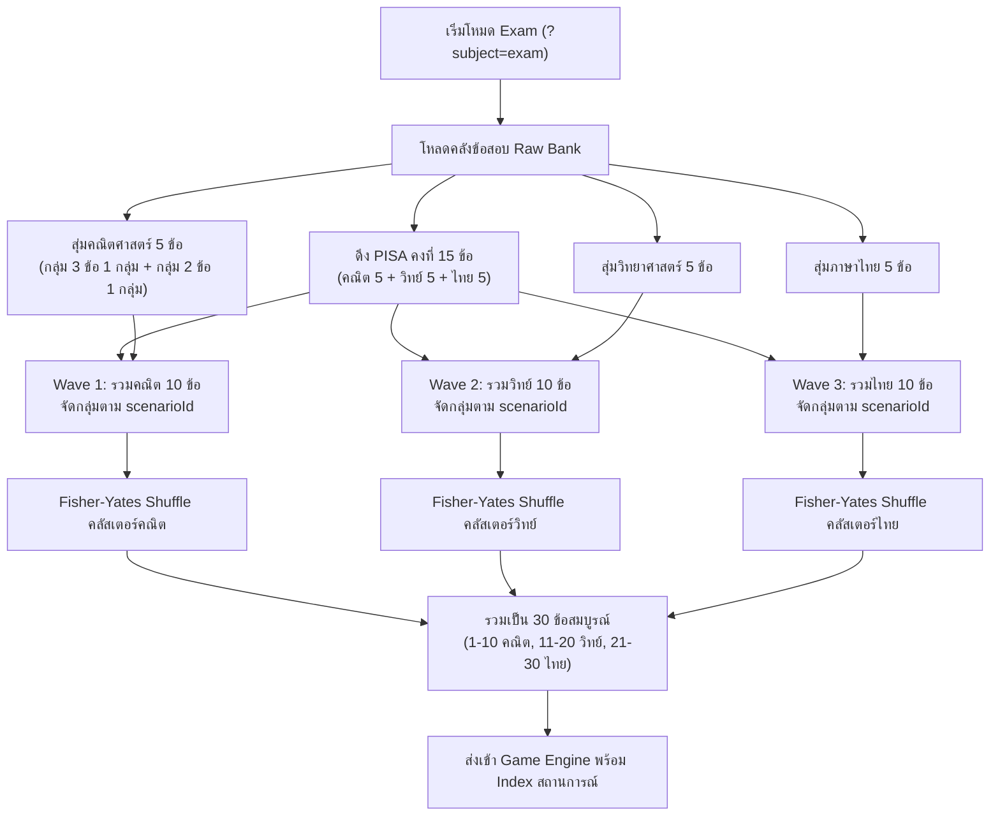
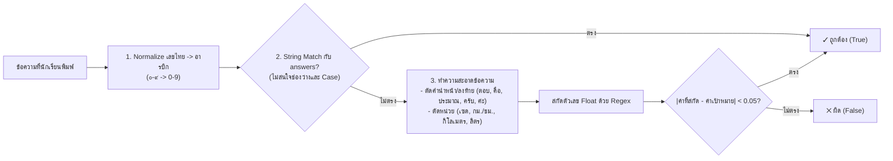

# รายงานสรุปการพัฒนาระบบข้อสอบรวม (Exam Mode), ข้อสอบ PISA, และระบบตรวจข้อเขียนอัจฉริยะ (Smart Grading)

> อัปเดต 9 ตุลาคม 2026: ส่วนด้านล่างเป็นรายงานการพัฒนารอบก่อน มีข้อค้นพบที่ได้รับการแก้ไขแล้ว ดูผลตรวจล่าสุดและข้อจำกัดใน [TEST_REPORT.md](TEST_REPORT.md)
>
> ปัจจุบัน Admin รักษาฟิลด์ข้อเขียน, ข้อสอบมี ID ถาวร, fallback สร้างจาก JSON พร้อมสถานการณ์, callback เพิ่ม `question_ids`, grading ปฏิเสธข้อความกำกวมและใช้ tolerance `< 0.05` แบบทศนิยมที่แน่นอน ไม่ตรวจความถูกต้องของหน่วยตามนโยบายเดิม รับดีวีดีทั้ง `54`/`54.4` และน้ำมัน `12.5`/`13` การสุ่มใหม่ไม่รับประกันว่าจะไม่ซ้ำรอบก่อน
>
> ผล “100%” เดิมครอบคลุมกรณีที่ทดสอบในรอบนั้น ไม่ใช่ทุก input หรือทุกอุปกรณ์ การตรวจ UI/UX รอบล่าสุดเป็นการตรวจโดยผู้พัฒนา ไม่ใช่ usability test กับผู้เรียน

เอกสารฉบับนี้สรุป **สิ่งที่ได้ดำเนินการ (What was done)** และ **สิ่งที่ได้ค้นพบ/เรียนรู้จากฐานข้อมูลโจทย์ (Findings & Knowledge)** ทั้งหมดในโปรเจกต์ Pirate Quiz Tower Defense

---

## 1. วัตถุประสงค์และขอบเขตงาน (Overview & Scope)

1. **โหมดข้อสอบรวมแบบสุ่ม (`?subject=exam`):**
   - นักเรียนแต่ละคนที่เข้าทำข้อสอบจะได้รับข้อสอบจำนวน **30 ข้อ**
   - ประกอบด้วย **ข้อสอบ PISA 15 ข้อคงที่** จากไฟล์ `ข้อสอบจริง/โจทย์เพิ่มเติม (Pisa อย่างละ 5).docx` (คณิต 5, วิทย์ 5, การอ่าน 5) เสมอในทุกรอบ
   - อีก **15 ข้อจะสุ่มมาจากคลังวิชาละ 5 ข้อ** (คณิตศาสตร์ 5 ข้อ, วิทยาศาสตร์ 5 ข้อ, ภาษาไทย 5 ข้อ)
   - **กฎความต่อเนื่องของสถานการณ์ (Scenario Continuity):** หากข้อสอบข้อใดมีสถานการณ์อ้างอิงร่วมกัน ข้อสอบชุดนั้นจะต้องถูกดึงมาทั้งชุดและเรียงติดกันเสมอ 100% ห้ามแยกออกจากกัน
2. **ระบบสลับข้อสอบ (Question Shuffling):**
   - สลับข้อสอบในแต่ละรอบโดยแบ่งเป็น 3 ช่วงตามกลุ่มวิชา (Wave):
     - **Wave 1 (ข้อ 1–10):** วิชาคณิตศาสตร์ (10 ข้อ สลับตำแหน่งกัน)
     - **Wave 2 (ข้อ 11–20):** วิชาวิทยาศาสตร์ (10 ข้อ สลับตำแหน่งกัน)
     - **Wave 3 (ข้อ 21–30):** วิชาภาษาไทย (10 ข้อ สลับตำแหน่งกัน)
   - ข้อสอบที่อยู่ในกลุ่มสถานการณ์เดียวกันจะถูกล็อกเป็น Cluster และสลับทั้งกลุ่ม ทำให้ข้อสอบไม่อยู่กระจัดกระจาย
3. **ระบบข้อเขียน (Short-Answer / Text Input) & Smart Grading:**
   - สำหรับข้อสอบที่เป็นอัตนัย/ข้อเขียน ระบบจะเปลี่ยน UI จากปุ่ม 4 ตัวเลือกมาเป็น **ช่องพิมพ์คำตอบพร้อมป้ายกำกับหน่วยและปุ่มส่งคำตอบ**
   - ระบบตรวจคำตอบอัจฉริยะ (Smart Grading) ต้องตรวจถูกแม้ผู้เรียนจะพิมพ์เลขไทย, มีคำนำหน้า/คำลงท้ายฟุ่มเฟือย, หรือพิมพ์หน่วยซ้ำซ้อน
   - ไอเทมกล้องส่องทางไกล (Telescope) เมื่อใช้กับข้อเขียน จะแสดงคำใบ้เป็นช่วงตัวเลขคำตอบ

---

## 2. สิ่งที่ค้นพบจากไฟล์ข้อสอบจริง (Findings & Document Analysis)

### 2.1 ไฟล์ `ข้อสอบจริง/โจทย์เพิ่มเติม (Pisa อย่างละ 5).docx`
- **โครงสร้างไฟล์:** มีข้อสอบทั้งหมด 15 ข้อ แบ่งเป็น 3 วิชา วิชาละ 5 ข้อ พร้อม 10 สถานการณ์
- **ภาพประกอบ:** พบภาพกราฟความเร็วรถแข่ง PISA ในข้อ 2 ของคณิตศาสตร์ สกัดออกมาเป็นไฟล์ `assets/images/questions/math/pisa_driving.png`
- **ข้อสอบที่เป็นข้อเขียน (อัตนัย):**
  1. **คณิตศาสตร์ ข้อ 1 (เรื่องร้านเช่าดีวีดี):** คำตอบคือ `54` หน่วย `เซด`
  2. **คณิตศาสตร์ ข้อ 2 (เรื่องความเร็วรถแข่ง):** คำตอบคือ `60` หน่วย `กิโลเมตรต่อชั่วโมง`
- **ข้อสอบส่วนที่เหลือ:** เป็นปรนัย 4 ตัวเลือก (คณิตศาสตร์ ข้อ 3–5, วิทยาศาสตร์ ข้อ 1–5, การอ่าน ข้อ 1–5)

### 2.2 ไฟล์ `ข้อสอบจริง/คณิตศาสตร์.docx`
- **โครงสร้างไฟล์:** มีข้อสอบ 30 ข้อ จัดเป็น 11 ชุดสถานการณ์
- **พบข้อสอบข้อเขียน 2 ข้อ (เดิมใน docx ไม่มีตัวเลือก ก. ข. ค. ง.):**
  1. **ข้อ 13 ใน docx (ข้อ 12 ในระบบ `math.json`):** เรื่องระยะทางที่สั้นที่สุดจากบ้านไปโรงเรียน คำตอบคำนวณจากแผนภาพมินิเกมได้ **`10`** หน่วย **`กิโลเมตร`**
  2. **ข้อ 14 ใน docx (ข้อ 13 ในระบบ `math.json`):** เรื่องการเติมน้ำมันไป-กลับ 5 วัน (ระยะทางรวม 100 กม., อัตราสิ้นเปลือง 8 กม./ลิตร คำนวณได้ $100 \div 8 = 12.5$ ลิตร หรือคิดเป็นจำนวนเต็มลิตรที่ต้องเติมอย่างน้อย **`13`** ลิตร) หน่วย **`ลิตร`**
  *(ในระบบเดิมก่อนหน้านี้ถูกใส่ตัวเลือกจำลองไว้ 10, 12, 14, 16 กม. และ 5, 10, 15, 20 ลิตร ปัจจุบันปรับเป็นข้อเขียนจริงแล้ว)*
- **การจัดกลุ่มสถานการณ์ในวิชาคณิตศาสตร์:**
  - กลุ่ม 3 ข้อ: `fitd-fitness`, `bacteria`, `gelato`, `boss-quest`, `product-review`, `cell-broadcast`
  - กลุ่ม 2 ข้อ: `solar`, `shortest-path`, `train`, `tutoring-institute`
  - กลุ่ม 4 ข้อ: `gacha`
  *(ดังนั้น การสุ่มวิชาคณิตศาสตร์ให้ได้ 5 ข้อโดยไม่ตัดแบ่งสถานการณ์ สามารถทำได้โดยสุ่มกลุ่ม 3 ข้อ 1 กลุ่ม + กลุ่ม 2 ข้อ 1 กลุ่ม)*

### 2.3 ไฟล์ `ข้อสอบจริง/วิทย์.docx` และ `ข้อสอบจริง/ภาษาไทย.docx`
- ตรวจสอบแล้วพบว่ามีตัวเลือก 4 ตัวเลือกครบถ้วนทุกข้อ (ปรนัย 100%)

---

## 3. สถาปัตยกรรมระบบและการทำงาน (Architecture & Implementation)

### 3.1 การสุ่มและจัดคลัสเตอร์ข้อสอบ (`web/js/quiz.js`)



#### ฟังก์ชันสำคัญ:
- `clusterAndShuffleQuestions(questionList)`: จัดข้อสอบที่มี `scenarioId` เดียวกันเป็น Array ย่อย (Cluster) จากนั้นทำการสลับตำแหน่งด้วย Fisher-Yates แล้ว Flatten กลับเป็น Array เดียว ทำให้ข้อสอบในสถานการณ์เดียวกันไม่ถูกแยกจากกัน
- `sampleExamFromBank(bank)`: ประมวลผลการสุ่มและจัดชุดข้อสอบรวม 30 ข้อตามเงื่อนไข
- `refreshExamQuestionsIfDynamic()`: ทำการสุ่มข้อสอบชุดใหม่ทันทีเมื่อเริ่มเกมใหม่ (`restartGame()`) โดยอาจสุ่มได้ลำดับเดิมโดยบังเอิญ

---

### 3.2 ระบบข้อเขียน (Short-Answer / Text Input)

#### โครงสร้างฟิลด์ข้อสอบแบบข้อเขียนใน JSON:
```json
{
  "q": "ข้อความโจทย์...",
  "type": "input",
  "unit": "กิโลเมตร",
  "placeholder": "พิมพ์ระยะทาง (กิโลเมตร)...",
  "targetNumber": 10,
  "targetNumbers": [10],
  "answers": ["10", "10 กิโลเมตร", "10 กม."],
  "correctDisplay": "10",
  "c": ["", "", "", ""],
  "a": 0,
  "scenarioId": "shortest-path"
}
```

#### ส่วนติดต่อผู้ใช้ (UI Integration ใน `web/index.html` & `web/style.css`):
- เมื่อ `qData.type === "input"`:
  - ซ่อน `.choices-grid`
  - แสดง `#input-answer-container`
  - ตั้งค่า Placeholder และแสดงป้ายหน่วยบน `#quiz-input-unit`
  - ให้ช่องพิมพ์โฟกัสอัตโนมัติ
  - รองรับการกดปุ่ม `Enter` เพื่อส่งคำตอบทันที

---

### 3.3 ระบบตรวจคำตอบอัจฉริยะ (Smart Grading Engine)

ฟังก์ชัน `checkTextAnswer(userInput, qData)` ใน `web/js/quiz.js` ทำงานผ่าน 3 ขั้นตอน:



#### ตัวอย่างคำตอบที่ผ่านการทดสอบว่าตรวจถูก 100%:
| ข้อสอบ | คำตอบเป้าหมาย | ตัวอย่างคำตอบของนักเรียนที่ระบบตรวจว่า "ถูกต้อง" |
|---|---|---|
| **PISA คณิต Q1** | `54` เซด | `54`, `54 เซด`, `๕๔`, `๕๔ เซด`, `ตอบ 54`, `ตอบ 54 เซดครับ`, `ประมาณ 54`, `54 zeds` |
| **PISA คณิต Q2** | `60` กม./ชม. | `60`, `60 กิโลเมตรต่อชั่วโมง`, `60 กม./ชม.`, `๖๐`, `๖๐ กม/ชม`, `ความเร็ว 60`, `ตอบ 60 ครับ` |
| **คณิตศาสตร์ Q12** | `10` กิโลเมตร | `10`, `10 กิโลเมตร`, `10 กม.`, `๑๐`, `๑๐ กม.`, `ตอบ 10 กิโลเมตรครับ`, `ระยะทาง 10 กม.` |
| **คณิตศาสตร์ Q13** | `12.5` หรือ `13` ลิตร | `12.5`, `13`, `12.5 ลิตร`, `13 ลิตร`, `๑๒.๕`, `๑๓`, `ตอบ 12.5 ลิตร`, `เติมน้ำมัน 13 ลิตรครับ` |

---

### 3.4 ไอเทมตัวช่วยและการคิดคะแนนใน Game Engine (`web/js/game.js`)

1. **กล้องส่องทางไกล (Telescope):**
   - หากใช้กับข้อสอบปรนัย: ตัดช้อยส์ผิด 2 ข้อ
   - หากใช้กับข้อเขียน: คำนวณช่วงคำตอบ $\pm 15\%$ แล้วแสดงคำใบ้ใน `#quiz-input-hint` เช่น:
     - *"🔭 กล้องส่องทางไกลใบ้: ค่าตัวเลขคำตอบอยู่ระหว่าง 50 ถึง 60 เซด"*
     - *"🔭 กล้องส่องทางไกลใบ้: ค่าตัวเลขคำตอบอยู่ระหว่าง 5 ถึง 15 กิโลเมตร"*
2. **การบันทึกคำตอบและคำนวณผลสอบ (`answersLog`):**
   - ข้อสอบปรนัยบันทึก Index ตัวเลือก (`0–3`)
   - ข้อสอบข้อเขียนบันทึกข้อความจริงที่ผู้เรียนพิมพ์
   - ฟังก์ชัน `updateResultSummary()` และ `submitExamResults()` รองรับการเรียก `checkTextAnswer()` สำหรับข้อเขียน เพื่อคิดคะแนนสุทธิและส่งกลับผ่าน `CALLBACK_URL` ได้อย่างแม่นยำ

---

## 4. สรุปไฟล์ที่ถูกสร้างและแก้ไข (Summary of Changes)

| ไฟล์ | สถานะ | หน้าที่และรายละเอียดการเปลี่ยนแปลง |
|---|---|---|
| [`assets/data/pisa.json`](assets/data/pisa.json) | สร้างใหม่ | ข้อสอบ PISA 15 ข้อคงที่ (คณิต 5 ข้อ, วิทย์ 5 ข้อ, การอ่าน 5 ข้อ) |
| [`assets/data/scenarios/pisa.json`](assets/data/scenarios/pisa.json) | สร้างใหม่ | 10 สถานการณ์อ้างอิงสำหรับข้อสอบ PISA |
| [`assets/images/questions/math/pisa_driving.png`](assets/images/questions/math/pisa_driving.png) | สร้างใหม่ | ภาพกราฟความเร็วรถแข่ง PISA สกัดจากไฟล์ docx |
| [`assets/data/exam.json`](assets/data/exam.json) | แก้ไข | ชุดข้อสอบรวม 30 ข้อตั้งต้น (ใช้สำหรับ Fallback/Admin Preview) |
| [`assets/data/scenarios/exam.json`](assets/data/scenarios/exam.json) | แก้ไข | รวมสถานการณ์สำหรับข้อสอบชุดตั้งต้น |
| [`assets/data/math.json`](assets/data/math.json) | แก้ไข | อัปเดตข้อ 12 และข้อ 13 (ระยะทางสั้นสุด/น้ำมัน) ให้เป็น `type: "input"` |
| [`web/js/quiz.js`](web/js/quiz.js) | แก้ไข | เพิ่ม Fallback Data, ตัวสุ่มชุดข้อสอบ `sampleExamFromBank`, ฟังก์ชันสลับข้อ `clusterAndShuffleQuestions`, และระบบตรวจข้อเขียน `checkTextAnswer` |
| [`web/js/game.js`](web/js/game.js) | แก้ไข | เพิ่ม `submitCurrentTextAnswer()`, สลับ UI ข้อเขียนใน `loadQuestion()`, ระบบใบ้ของกล้องส่องทางไกล, คิดคะแนนส่งกลับ |
| [`web/index.html`](web/index.html) | แก้ไข | เพิ่มมาร์กอัป `#input-answer-container` สำหรับช่องกรอกข้อเขียนและป้ายหน่วย |
| [`web/style.css`](web/style.css) | แก้ไข | สไตล์โจรสลัดสำหรับกล่องข้อความ, ปุ่มส่ง, และกล่องคำใบ้ |
| [`web/admin.html`](web/admin.html) | แก้ไข | เพิ่มตัวเลือกเปิดดู/แก้ไขชุดข้อสอบ PISA ใน Dropdown ของ Admin |
| [`README.md`](README.md) | แก้ไข | บันทึกคู่มือการใช้งานโหมดข้อสอบรวม, ระบบสุ่มสลับข้อ, และ Smart Grading |

---

## 5. ผลการทดสอบการทำงาน (Verification & Test Results)

1. **การสุ่มและการสลับข้อ (50 Trials):**
   - ออกข้อสอบครบ 30 ข้อทุกรอบ (100%)
   - มีข้อสอบ PISA 15 ข้อครบถ้วนทุกรอบ (100%)
   - สลับข้อสอบกระจายครบทั้ง 10 รูปแบบในข้อแรก (ไม่เริ่มที่ข้อเดิมซ้ำๆ)
   - ไม่พบการแตกหักของสถานการณ์ต่อเนื่อง (Scenario continuity = 100%)
2. **การตรวจข้อสอบข้อเขียน (Smart Grading Test Suite):**
   - ทดสอบครอบคลุมทุกกรณี (เลขไทย, คำนำหน้า/คำลงท้าย, หน่วยซ้ำ, ตัวเลขทศนิยม): ผ่าน 100% ทุกกรณี
3. **การทดสอบความเข้ากันได้กับ Git:**
   - ได้ดำเนินการ Commit และ Push ขึ้น GitHub (`origin/main`) เรียบร้อยแล้ว (Commit `f98c83c` และ `347a758`)
